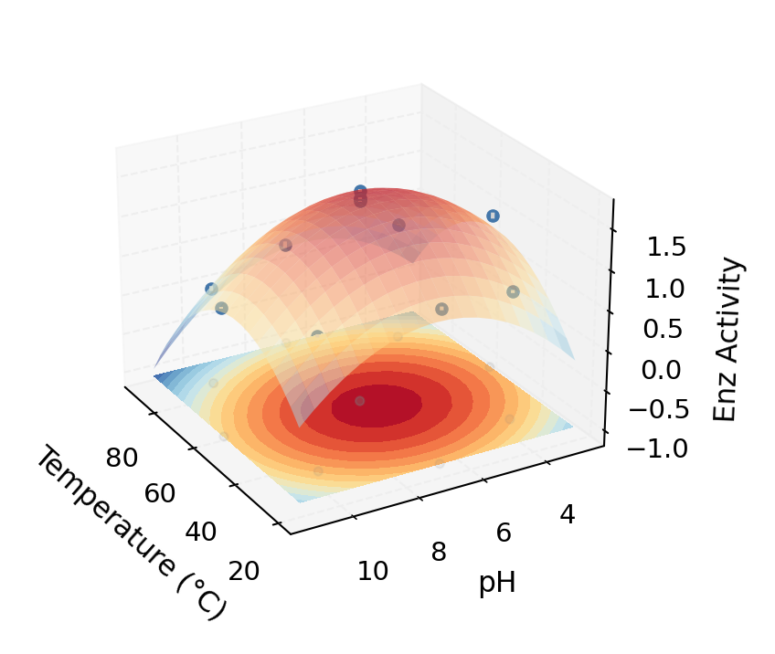

Equation:

$Atividade enz = a + b(Temp) + c(pH) + d(Temp)(pH) + e(Temp)^2 + f(pH)^2$

Fitted prameters:
[-3.21005501e+00  9.36254010e-02  7.15362546e-01 
-1.04666645e-03 -8.49899915e-04 -4.90486263e-02]

RMSE: 0.09531868403426236

R-squared: 0.9637436022100435

Predicted max activity: 50.92°C, pH 6.75

