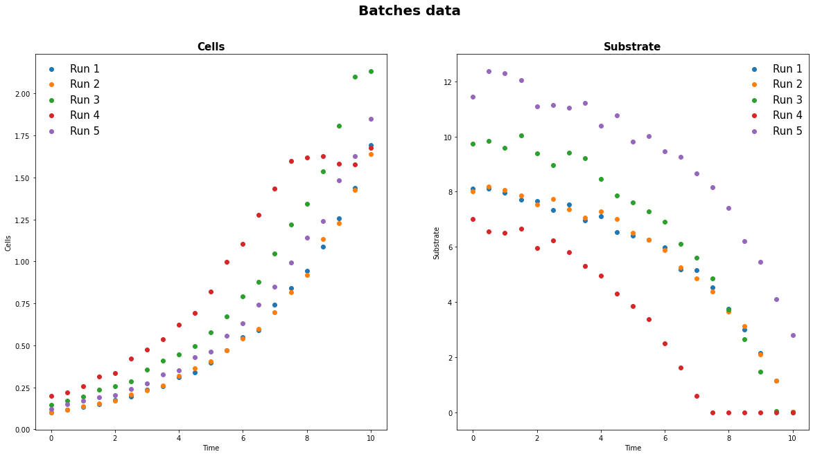
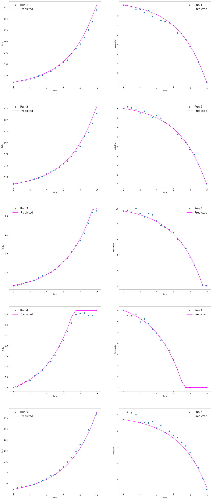
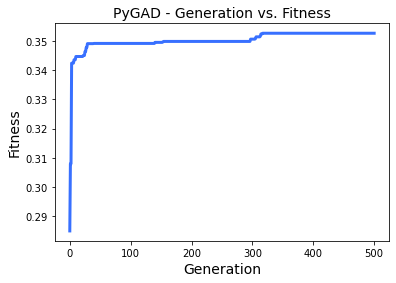

# Algoritmo genético para estimativa de parâmetros

Parameters of the best solution : [3.21501490e-01 4.23752896e-02 5.59686960e+01 2.10614234e-01]
Fitness value of the best solution = 0.35268326618061246
Best fitness reached at generation 363

