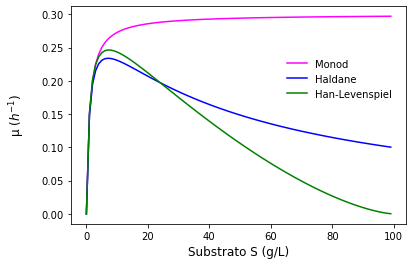

# Growth models

* Monod (1942): only one growth limiting substrate in the bioreactor

$\mu=\frac{\mu_{max}S}{K_{S}+S}$

* Haldane (1930): deals with specific growth rate inhibition at low and high substrate concentration. The advantage of the Haldane model is that it is capable of describing all growth phases: lag, exponential, stationary, and death phase. 

$\mu=\frac{\mu_{max}S}{K_{S}+S+\frac{S^2}{K_{i}}}$

* Han-Levenspiel (1988): includes inhibition effects that are present due to high concentration of substrate, cells, or other products. The model is capable of explaining the types of inhibition as either competitive or non-competitive. 

$\mu=\mu_{max}[1-\frac{S}{S_{m}}]^n[\frac{S}{S+K_{S}(1-\frac{S}{S_{m}})^m}]$

