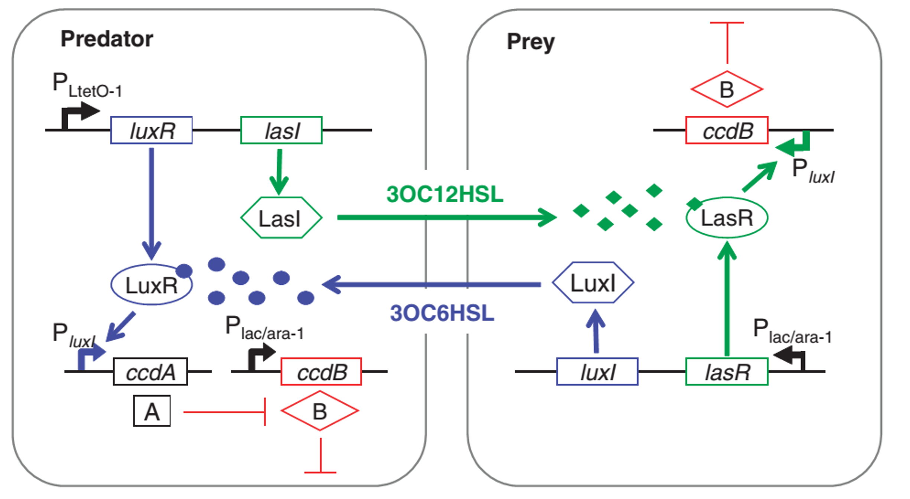
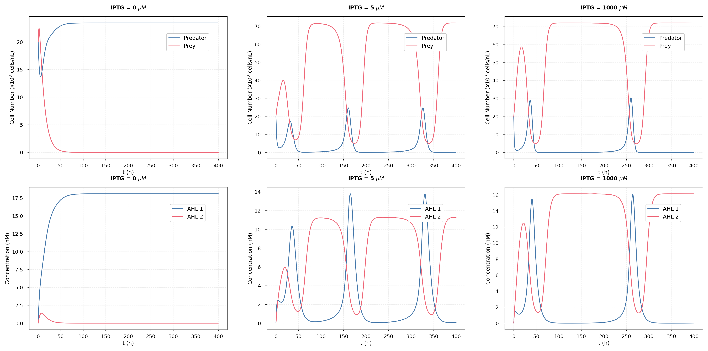
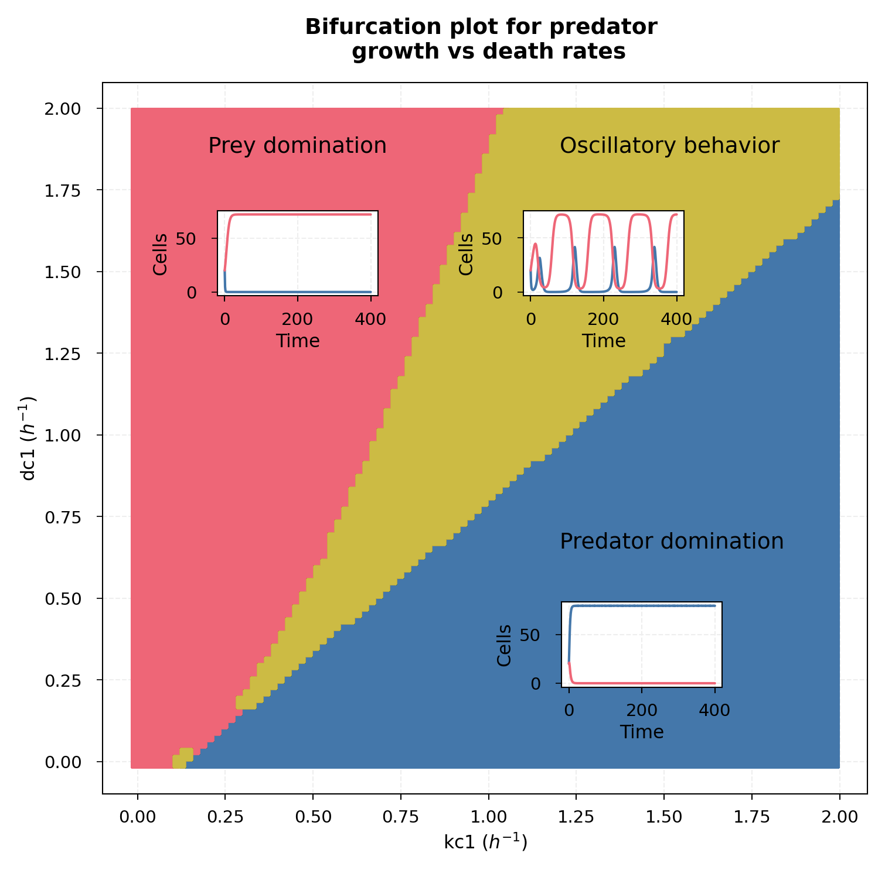

# Predator-Prey model behaviour

Based on:\
Balagaddé, F K; Song, H; Ozaki, J; Collins, C H; Barnet, M; Arnold, F H; Quake S R; You, L. (2008) A synthetic *Escherichia coli* predator-prey ecosystem. **Molecular Systems Biology** 4:187. doi:[10.1038/msb.2008.24](https://doi.org/10.1038/msb.2008.24)\

The paper from Balagaddé *et al.* constructed two *E. coli* populations capable of communicating with each other and inducing their death or survival. This synthetic ecosystem is similar to a predator-prey relation. The complete signaling between the two cell types is depicted in Figure 1. The synthetic circuit uses the quorum sensing mechanism as signals: LasI/LasR (in green) and LuxI/LuxR (in blue). The predator cells constitutively produce the LuxR regulator and LasI inducer. The latter is responsible for producing an acyl-homoserine-lactone (AHL) recognized by the LasR regulator present in the prey cell. This regulator will induce the production of a suicide gene (ccdB) which will kill the prey. In the presence of an inducer (IPTG) the prey cell produces LasR and LuxI inducer. LuxI produces a different quorum sensing molecule (3OC6HSL), which interacts with LuxR in the predator cell. IPTG also induces the production of the suicide gene in the predator. However, the LuxR regulator in the presence of the AHL signal will repress the predator cell death through ccdA. In summary, the predator cell sends a signal that causes the prey to die, while the prey sends a signal that prevents the predator death. Depending on the amount of induction and cell number, it is possible to obtain different population dynamics where only one cell population prevails, or an oscillatory pattern between both occur.

Figure 1 – Schematic diagram of the communication network between the predator and prey cells populations. Source: Balagaddé *et al.* (2008).

They came up with a simplified model that focus only on cell and signal molecules concentrations. Other components present in the more complex model have been lumped together in arbitrary parameters (such as K, dc, and beta), or assumed to be at a quasi-steady state (mRNA, transcriptional regulators, killer protein). The simplified model comprised of:

$\frac{dc_{1}}{dt}=k_{c1}(1-\frac{c_{1}+c_{2}}{c_{max}})-d_{c1}c_{1}\frac{K_{1}}{K_{1}+A_{e2}^\beta}-Dc_{1}$\
$\frac{dc_{2}}{dt}=k_{c2}(1-\frac{c_{1}+c_{2}}{c_{max}})-d_{c2}c_{2}\frac{A_{e1}^\beta}{K_{2}+A_{e1}^\beta}-Dc_{2}$\
$\frac{dA_{e1}}{dt}=k_{A1}c_{1}-(d_{Ae1}+D)A_{e1}$\
$\frac{dA_{e2}}{dt}=k_{A2}c_{2}-(d_{Ae2}+D)A_{e2}$\

where the subscript 1 indicates the predator cell and 2 the prey cell; c is cell concentration, $k_{c}$ the cell growth rate, $c_{max}$ the maximal cell concentration possible in the microchemostat, $d_{c}$ the death rate, K the concentration of signal molecule for half-maximal active promoter, $k_{A}$ the synthesis rate of the AHL signal molecule, $d_{Ae}$ the degradation rate of signal molecule, $\beta$ the cooperativity of AHL effect, and D the dilution rate of the microchemostat.
The genetic circuit that they constructed ties the predator cell death rate and the AHL 2 synthesis rate to the concentration of an inducer (IPTG). Therefore, the following empirical equations were used:

$d_{c1}=0.5+1\frac{[IPTG]^2}{5^2+[IPTG]^2}$\
$k_{A2}=0.02+0.03\frac{[IPTG]^2}{5^2+[IPTG]^2}$\

These equations where solved with the Python script and depending on the growth/death rate of the cells, different population dynamics arise.

Figure 2 – Different population dynamics with varying IPTG induction levels (0, 5, 1000 $\mu M$).

Figure 3 – Bifurcation plot for different predator growth and death rates.

