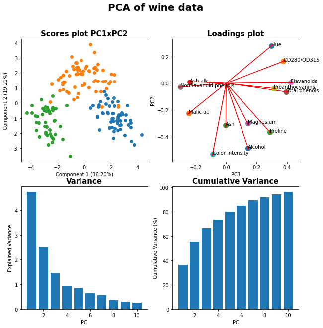

# Exemplos de códigos em Python para Biotec

* Balanço de massa em reator CSTR
* Transformação de imagem por SVD
* Análise da equação de Hill
* PCA: análise de componentes principais
* Algoritmo genético

