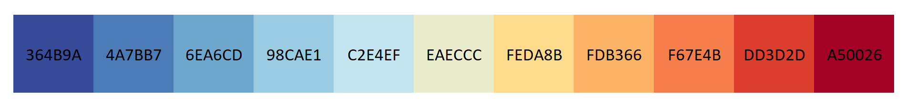

# Exemplos de códigos em Python para Biotec

## Análise de EDOs 
* [Balanço de massa em reator CSTR](https://github.com/Bmottan/biotech-code-examples/tree/main/Reactor%20mass%20balance)
* [Equções de crescimento celular](https://github.com/Bmottan/biotech-code-examples/tree/main/Growth%20models)
* [Análise da equação de Hill](https://github.com/Bmottan/biotech-code-examples/tree/main/Hill%20equation)
* [Modelo presa-predador](https://github.com/Bmottan/biotech-code-examples/tree/main/Predator-Prey%20dynamics)
* [FBA - Análise de fluxo metabólico (no upload)](https://github.com/Bmottan/biotech-code-examples)

## Predição
* [Algoritmo genético - estimativa de parâmetros](https://github.com/Bmottan/biotech-code-examples/tree/main/Genetic%20algorithm)
* [Rede neural (no upload)](https://github.com/Bmottan/biotech-code-examples)

## Decomposição de matriz
* [Transformação de imagem por SVD](https://github.com/Bmottan/biotech-code-examples/tree/main/Image%20SVD)
* [PCA: análise de componentes principais](https://github.com/Bmottan/biotech-code-examples/tree/main/PCA)

## Análise estatística
* [Teste de Comparações Múltiplas de Amostras (ANOVA/Tukey)](https://github.com/Bmottan/biotech-code-examples/tree/main/Statistical%20difference)
* [Regressão não linear - Atividade enzimática] (https://github.com/Bmottan/biotech-code-examples/tree/main/Enzyme%20activity%20-%20surface%20plot)

## Seleção de cores para gráficos
* [Seleção de cor pelo comprimento de onda](https://github.com/Bmottan/biotech-code-examples/tree/main/Fuorescent%20Protein%20Spectra)
* [Usar preset de cores](https://github.com/Bmottan/biotech-code-examples/tree/main/style_preset)

