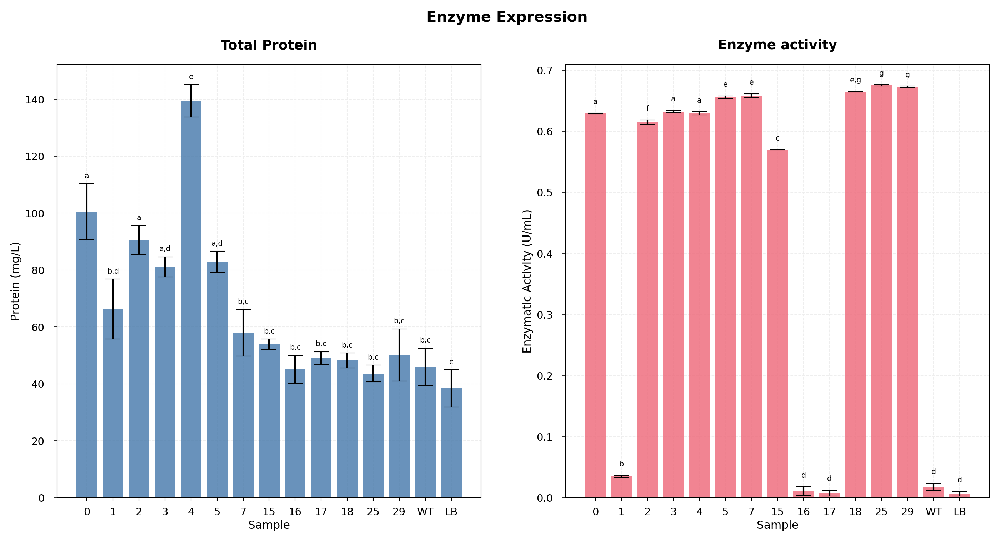

# Multiple comparisons to assess differences in group means

ANOVA oneway, Tukey HSD with Letters Indicating Significant Differences

Results of ANOVA test for Protein:
* The F-statistic is: 40.32052869692075
* The p-value is: 1.4222134354801178e-15 -> Significant difference between samples. Perform Tukey HSD.

Results of ANOVA test for Activity:
* The F-statistic is: 17426.39304611834
* The p-value is: 1.2028075165814087e-54 -> Significant difference between samples. Perform Tukey HSD.

