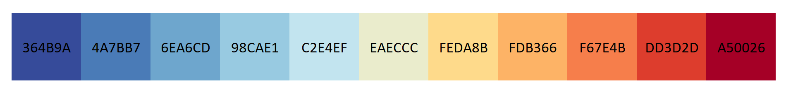

# Color Palettes

## QUALITATIVE COLOUR SCHEMES

Bright:

['4477AA', 'EE6677', 'CCBB44', '228833', '66CCEE', 'AA3377', 'BBBBBB']

## DIVERGING COLOUR SCHEMES

Sunset:

['364B9A', '4A7BB7', '6EA6CD', '98CAE1', 'C2E4EF', 'EAECCC', 'FEDA8B', 'FDB366', 'F67E4B', 'DD3D2D', 'A50026']

## SEQUENTIAL COLOUR SCHEMES

YlOrBr:

['FFFFE5', 'FFF7BC', 'FEE391', 'FEC44F', 'FB9A29', 'EC7014', 'CC4C02', '993404', '662506']

